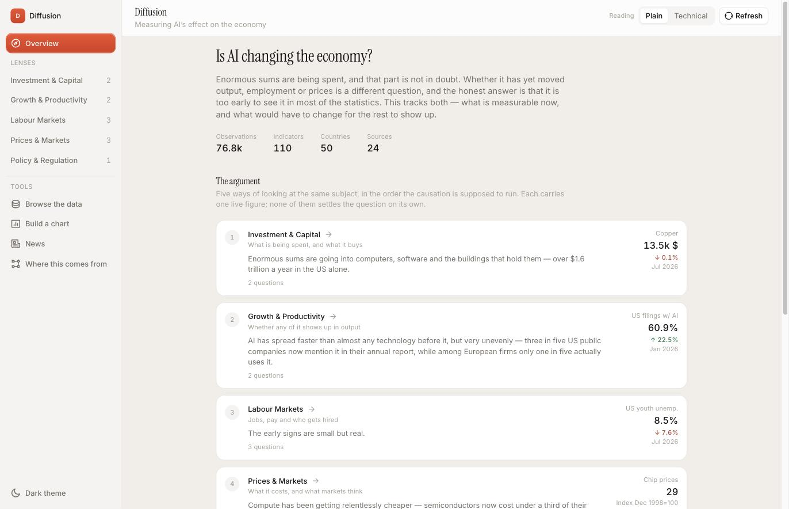
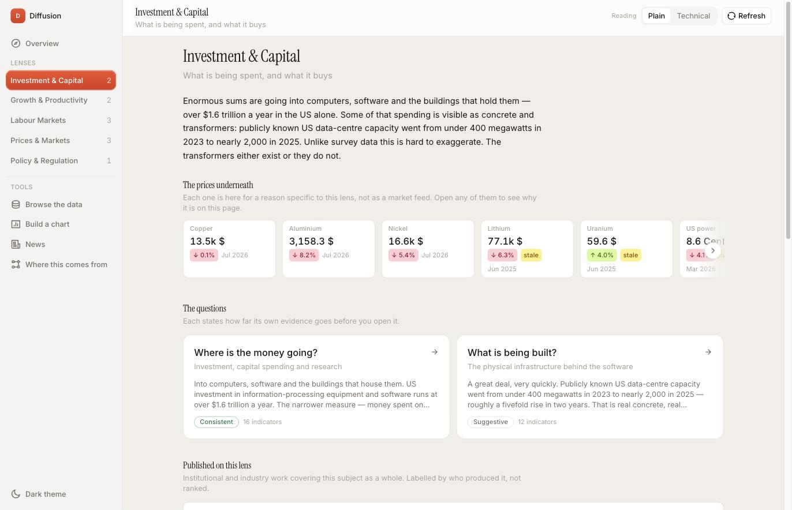
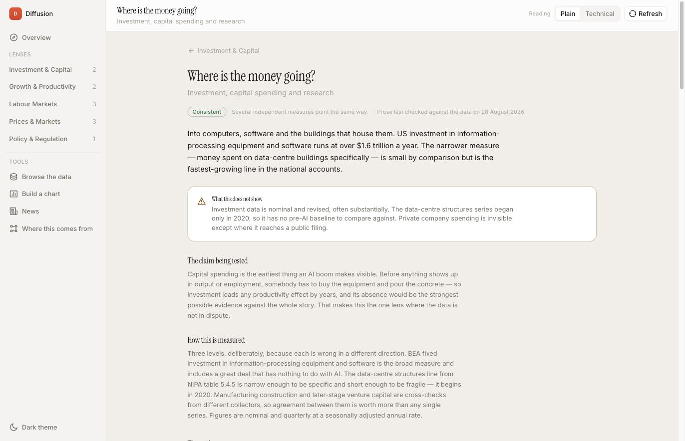
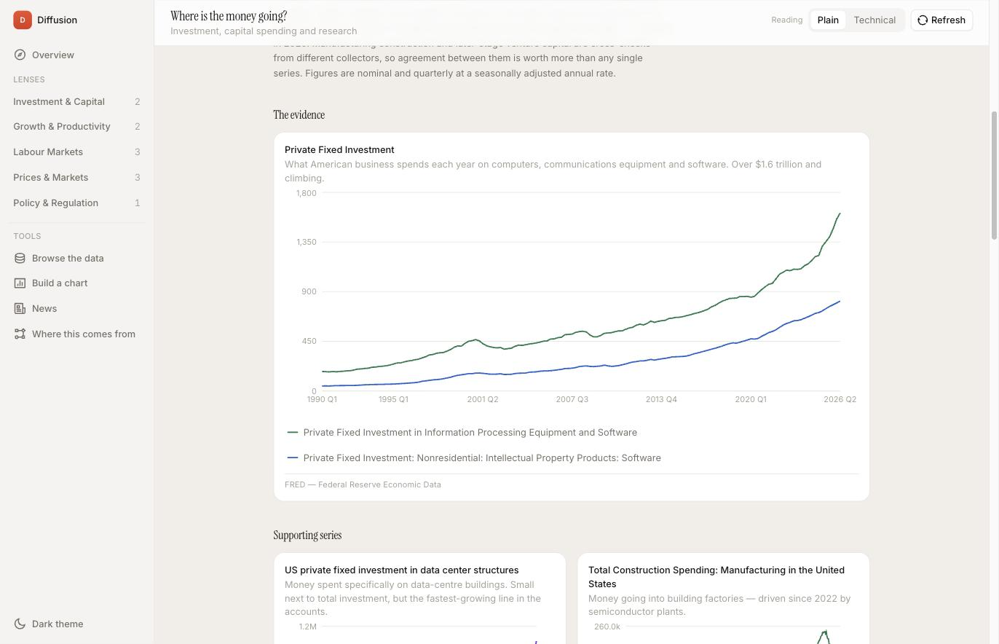
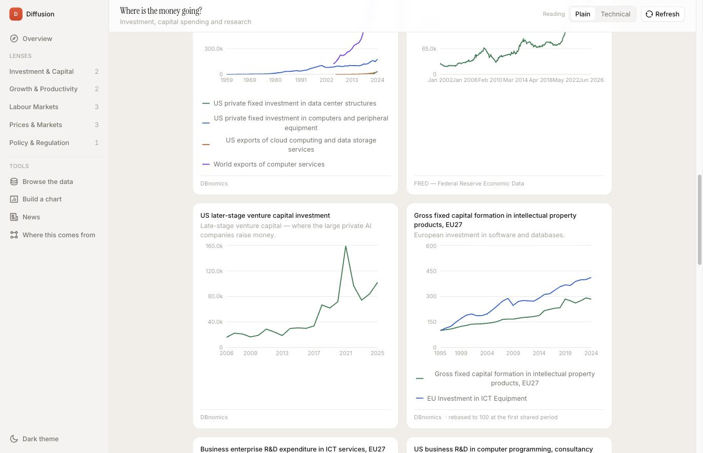

# Diffusion

**Is AI changing the economy?**

A public dashboard that tries to answer that honestly — including where the
answer is "we can't tell yet".

In economics, *technology diffusion* is how an innovation spreads through an
economy and shows up in measured output. In AI, diffusion models are a core
architecture. The name is the subject and the thesis at once.



---

## The problem this is built against

There is no shortage of confident writing about AI and the economy. Almost none
of it shows its working, and most of it is arguing for something.

Diffusion is the opposite bet: gather the data, state what it does and does not
support, and make the reasoning inspectable. It is built for researchers and
students — and for me, because I kept wanting it while writing a master's
thesis on whether generative AI adoption had moved US industry productivity.
(It mostly hadn't, which I found more interesting than if it had.)

## The rules it holds itself to

These are the point of the project. Everything else is implementation.

**No number here is written by a language model.** Every figure is computed in
SQL from a named source. Every claim is written by a person and dated. There is
a `narrations` table designed to cache LLM output *grounded in stored values* —
it is deliberately unused, and that is tracked as an open item rather than
implied to already be protecting something.

**What the data cannot show is a section, not a footnote.** Every question page
states its limits directly beneath its answer and above every chart. A page
with no caveat is usually a page that has not been thought about.

**Evidence strength is stated, including when it is insufficient.** Pages are
labelled `insufficient` / `suggestive` / `consistent` / `contested`. The
productivity question is marked **insufficient** — aggregate productivity
statistics are too noisy and too lagged to detect an effect this size this
early, so an absence of signal there is weak evidence of an absence of effect.
Saying so is the finding.

**Two registers, not one text with jargon added.** *Plain* states the finding.
*Technical* answers a different question: how it was measured, and where it
misleads.

**Prose is dated.** Numbers update on ingestion; sentences do not follow them.
Every page shows when a person last checked its writing against its data, and a
`stale_questions` view lists pages that have drifted.

**Charts are not allowed to flatter.** One y-axis, always — no dual-axis
charts. Zero baseline by default; where an index scale genuinely needs a padded
floor, the chart says *"axis does not start at 0"* on its face. A gap in the
data breaks the line rather than drawing a straight segment across months
nobody collected.

---

## How it is organised

Five **lenses** — classical economics subfields, in the order the causation is
supposed to run:

| Lens | The question underneath |
|---|---|
| Investment & Capital | What is being spent, and what it buys |
| Growth & Productivity | Whether any of it shows up in output |
| Labour Markets | Jobs, pay and who gets hired |
| Prices & Markets | What it costs, and what markets think |
| Policy & Regulation | What governments are actually doing |

Each lens reads as an article, not a container: the argument first, then the
prices it depends on, then the questions beneath it.



Eleven **questions** sit under those lenses. Each one runs in the order an
argument runs — the finding, how confident and when it was last checked, what
it cannot show, the claim being tested, how this page measures it, the
evidence, and what other people have published.



Then the evidence, with a caption on every chart explaining why that series is
on that page:





Every series is also browsable directly at `/data`, without going through an
argument — with its licence, its attribution, and a link back to the publisher.

---

## The data

**76,788 observations · 111 indicators with data · 24 sources**

(115 series are declared; four are defined but not yet computed, and are listed
as such rather than counted as if they existed.)

FRED · World Bank · DBnomics (93 statistical agencies through one adapter) ·
SEC EDGAR · Epoch AI · US Federal Register · LBMA · GDELT · 7 news feeds.

Diffusion **links and cites; it does not redistribute**. Every source carries
its licence and attribution in the database, and the per-series page displays
both. Take the data from the publisher.

### Where the data is weak — stated plainly

- **Country coverage is thin.** One country has real depth (the US, 61
  indicators). Thirty-nine of forty-nine carry the same six World Bank annual
  series. There is deliberately **no country-comparison UI**, because the data
  would not support the comparison it implied. This is the next thing being
  worked on.
- **Policy is starved** — six indicators, two of which are declared but not yet
  computed.
- **GDELT news-volume ingestion is broken** (connection timeouts).
- **The literature layer is citations only.** Twelve institutional and
  consulting reports are cited; their takeaways are deliberately empty until
  the documents are actually read, because a takeaway paraphrased from an
  abstract nobody opened is worse than none.

That list is tracked in full internally, under a standing rule: nothing is
written there as present-tense fact unless a code path enforces it right now.

---

## Stack

Node 24 (ESM) · Express 4 · Postgres 18 · React 19 · Vite · Tailwind v4 ·
BoardUI · Recharts · TanStack Query · React Router on real paths.

### Things worth looking at if you are reading the code

- **`scripts/check-tokens.js`** — a Tailwind class that does not exist does not
  throw, does not warn, and does not fail the build; it silently generates no
  CSS. Seven such classes shipped here and made the whole app look broken for
  weeks. This asserts the invariant nothing else will, and gates the build.
- **`scripts/check-contrast.js`** — every colour used as text or as a UI mark,
  checked against both card surfaces. `charts.css` had told people for months
  to run a validator that was never in the repo.
- **`src/server/ingestion/runner.js`** — `finishRun` redacts credentials at the
  point of storage, because `/api/status` renders ingestion errors publicly and
  a request URL carrying an API key would otherwise be published.
- **`db/migrations/`** — checksum-locked; editing an applied migration throws.
  Each one opens with why it exists, not what it does.
- **`db/seeds/012_lenses.sql`** — `lens_tickers.why` explains, per placement,
  what a price is doing on that specific page. Copper on Investment argues
  about build-out; copper on Prices argues about markets. That per-placement
  rationale is why the table exists instead of a column on `indicators`.

---

## Running it

```bash
npm install
cp .env.example .env      # DATABASE_URL is the only one required
npm run db:migrate && npm run db:seed
npm run build             # public/ is build output and is gitignored
npm start                 # http://localhost:3000
```

For development, `npm run dev` runs Express on 3000 and Vite on 5173 together —
**open 5173**, which hot-reloads and proxies `/api` to Express.

```bash
npm test                  # 62 tests
npm run check:tokens      # design tokens resolve
npm run check:contrast    # WCAG AA on both themes
npm run ingest -- rss --force   # refresh news; nothing auto-schedules yet
```

---

## Status

Actively being built, and unfinished in ways that are documented rather than
hidden. Ingestion is manual, there is no deploy yet, and the visual design has
had one pass.

If you are an economist: I would genuinely value you telling me where the
comparisons are wrong.
